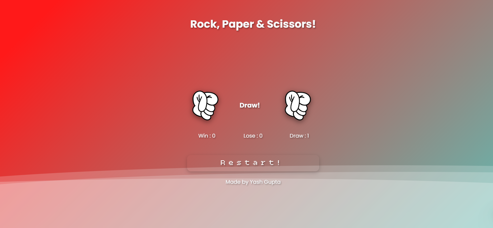

# 🪨 Stone - 📄 Paper - ✂️ Scissor Game

A responsive and animated **Stone-Paper-Scissor** game built using **HTML**, **CSS**, and **JavaScript**, with a modern UI, smooth animations, and sound effects. Play against the bot and keep track of your score – Win, Lose, or Draw!

🔗 **Live Demo:** [Click Here to Play](https://yashgupta271.github.io/Stone--Paper-Scissor/)

---

## 📸 Preview

 <!-- You can add your own preview image here -->

---

## 🎮 Features

- ✅ **Single Player Game** (You vs Bot)
- 🎨 Stylish & Modern UI with Gradient Backgrounds
- 🌀 Animated buttons with hover effects (disabled on mobile)
- 🗣️ Sound effect on each play
- 📱 **Mobile Responsive Design**
- 🧠 Bot logic with random selection
- 🔁 Restart button to play again without reloading
- 📊 Score tracking: Win / Lose / Draw

---

## 🧑‍💻 Tech Stack

- **HTML5** – Structure
- **CSS3** – Styling and animations
- **JavaScript (ES6)** – Game logic and interactivity
- **jQuery** – DOM manipulation and event handling

---

## 🚀 Getting Started

To run this project locally:

1. Clone the repo:
   ```bash
   git clone https://github.com/Yashgupta271/Stone--Paper-Scissor.git

2. Open the index.html file in your browser.

---

✅ No frameworks or build tools required — it's fully static and lightweight!

---

## 📁 Project Structure

```
Stone--Paper-Scissor/
├── images/        # Game images (stone, paper, scissor, vs)
├── sounds/        # Sound effects (rock-paper-scissor.mp3)
├── index.html     # Main HTML file
├── style.css      # All styling and animations
├── script.js      # Game logic and interactivity
└── README.md      # Project description
```

---

## 📱 Responsive Design

- Works on both desktop and mobile.
- Hover effects are disabled on touch devices for better UX.

---

## 🙋‍♂️ Author

**Yash Gupta**  
[GitHub Profile](https://github.com/yashgupta271)

---

⭐️ **Give it a Star!**  
If you like the project, consider giving it a ⭐️ on GitHub – it helps me grow and share more projects like this.


